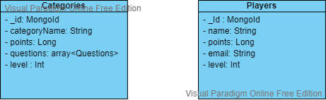

# __Laboratorio Java__
## -Proyecto #1. -
<br>

## Datos de Presentación

- Fecha: `15 de julio del 2022`
- Integrantes: `Camilo Morales Sánchez - Camilo Castañeda`

## Objetivos del Proyecto

- Construir un aplicativo de consola en java.
- Evidenciar el correcto uso de la programación orientada a objetos
- Manejar el control de versiones.
- Aplicar mejores prácticas y metodología de Ingeniería de Software
- Conexión a base de datos
- Crud base de datos


## Características de Arquitectura

- Manejo de componentes
- Modularizacion del código

## __Base de datos__ 

<br>
<p align="center">
  
  
</p>

__IMPORTANTE:__ 

1. Es necesario contar mínimamente con la última versión estable de Java 1.8 y maven. Asegurarse de contar con ella para poder instalar correctamente las dependencias necesarias para correr el proyecto.


2. Se debe crear la base de datos en `MongoDB` con las dos colecciones que se encuentran en el diagrama: en el archivo `categories.json` se comparte las preguntas iniciales para importarlas en la base de datos y adicional el archivo `player.json` muestra detalladamente la estructura de la colección


3. En la carpeta `src\main\resources` crear un archivo llamado: `application.properties` que tenga las siguientes variables necesarias para la conexión a la base de datos :<br>

- Ejemplo:

```

string_connection=mongodb://localhost:27017
name_database=Laboatorio-java

```
## Instrucciones del juego

1. El juego tiene 5 rondas, cada ronda tiene asignada una categoría y cada categoría tiene unas preguntas, el sistema escoge una pregunta aleatoriamente.
2. El jugador selecciona una opción de las 4 disponibles, si la respuesta es incorrecta el juego termina, si acierta pasa de ronda y aumenta la complejidad.
3. Cada ronda tiene una puntuación que se irá acumulando a medida que pase a la siguiente.
4. Se gana si se responden las 5 categorías.
